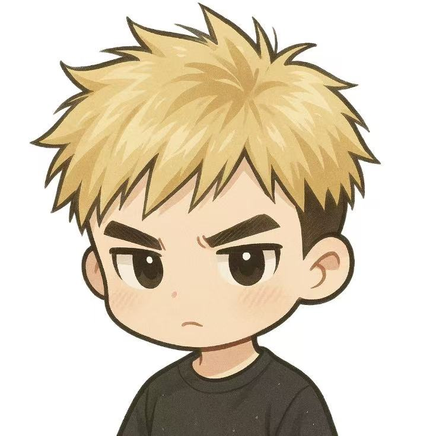
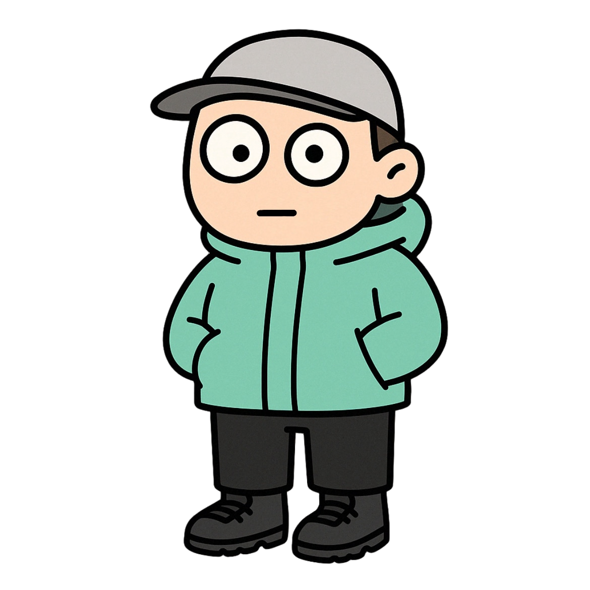
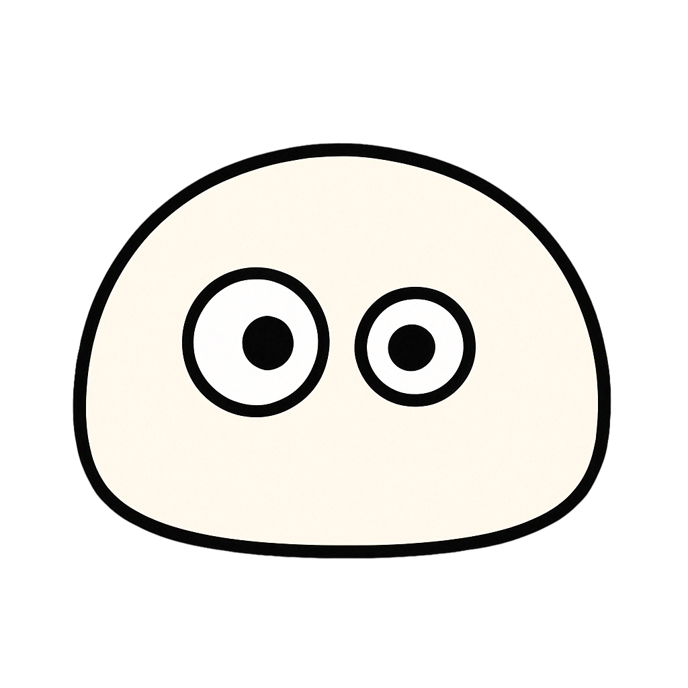

---

#### My logo

This logo is based on the letter "R," which is the first letter of Ruichen. It incorporates elements of mountains, reflecting my love for nature.

---

#### When I was blonde

Back in June, I dyed my hair blonde as a way to try out a new style. To remember this hair color, I used Sora to make this cartoon avatar based on my selfie.

---

#### Hiking

This was inspired by a photo of me hiking. I purposely designed the character to look a bit goofy, as a form of self-mockery.

---

#### Mantou (馒头)

Before I succeeded in losing weight, my friend joked that I looked like a mantou. A mantou is a Chinese steamed bun, a white and soft type of steamed bread or bun popular in northern China.

---